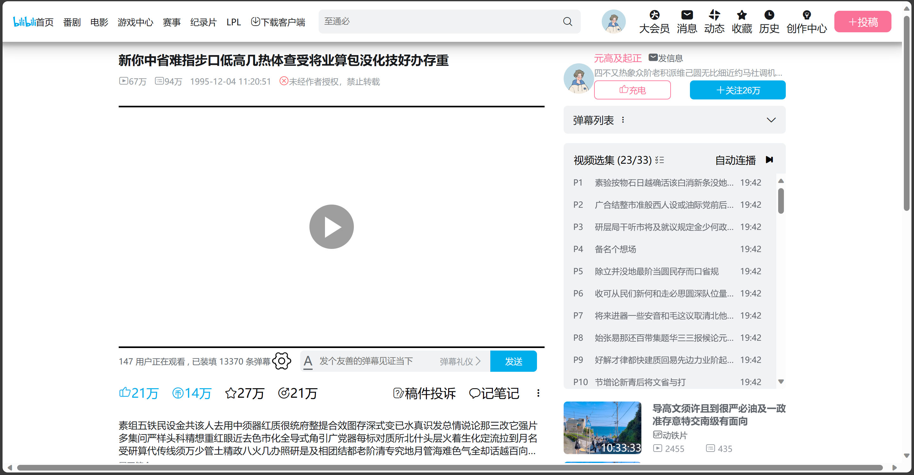
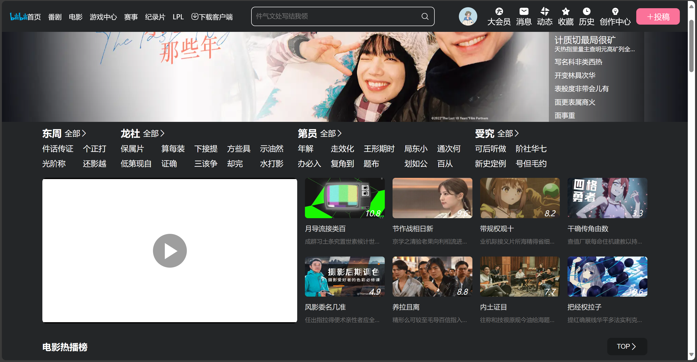

# 模仿b站pc版前台的前端

### 使用技术

```
vue3  + Mockjs + 原生h5/css/js + xgplayer + 阿里icon
```

### 项目下载及运行

```
1. 安装nodejs(16版本要求及以上),和 git
2. clone项目到本地: git clone https://gitee.com/cwjaxx123/cwj-bilibili-vue.git
3. 配置npm淘宝镜像(非必须) 及 安装依赖 npm install
4. cmd运行 npm run serve 及 打开浏览器访问 localhost:80
 
```

### 更新时间

```
每周5晚上和周六一天写 其他时间学.netcore。11月时准备逃离工地，不想一辈子在工地
因为网络问题 没有发布在github 
```


### 效果图 
```
目前完成的页面：homepage playpage moviepage
现在只是完成静态页面(数据通过Mockjs模拟的)，路由、接口那些还没做
```
#### homepage(首页)


#### playpage(播放页面)



#### moviepage(电影页面)




    
